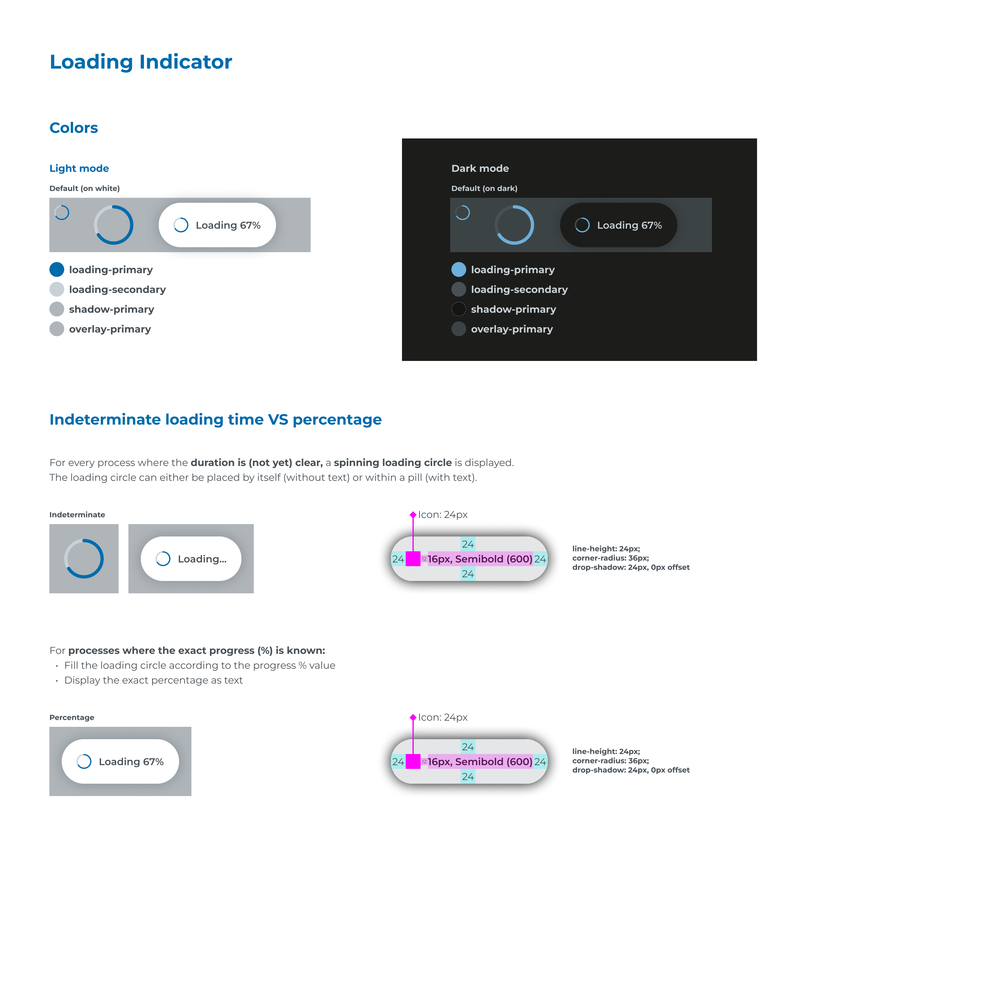

# Ecosystem Design Guidelines - Mandatory Layer-6

## Page 1

Loading Indicator
Indeterminate loading time VS percentage 
Colors
Light mode
For every process where the duration is (not yet) clear, a spinning loading circle is displayed. 
The loading circle can either be placed by itself (without text) or within a pill (with text).
For processes where the exact progress (%) is known: 
Fill the loading circle according to the progress % value
Display the exact percentage as text
Dark mode
Default (on dark)
loading-primary
loading-secondary
shadow-primary
overlay-primary
Loading 67%
Default (on white)
loading-primary
loading-secondary
shadow-primary
overlay-primary
Indeterminate
Percentage
Loading 67%
Loading...
16px, Semibold (600)
16px, Semibold (600)
Icon: 24px
Icon: 24px
24
24
24
24
24
24
24
24
12
12
line-height: 24px;
corner-radius: 36px;
drop-shadow: 24px, 0px offset
line-height: 24px;
corner-radius: 36px;
drop-shadow: 24px, 0px offset
Loading 67%

