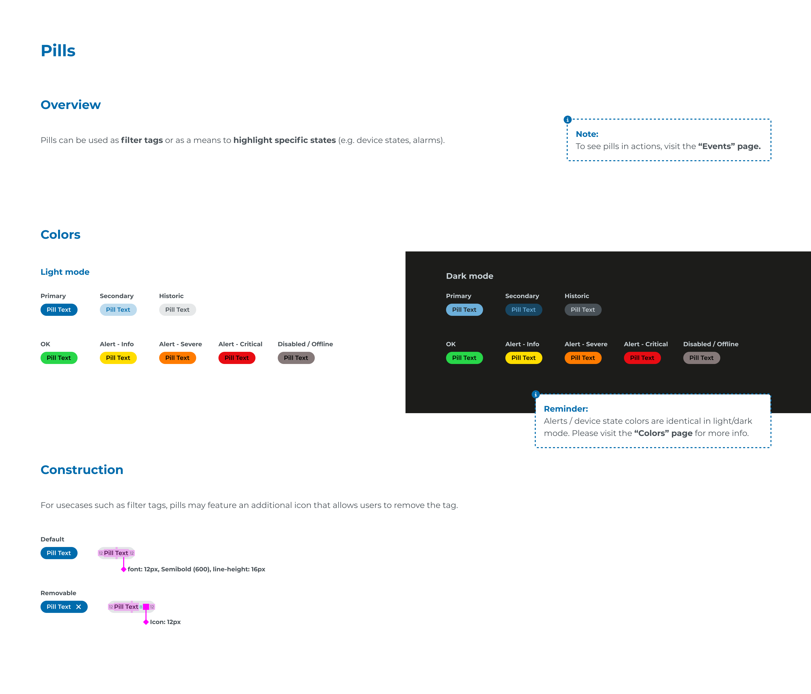

# Ecosystem Design Guidelines - Mandatory Layer-8

## Page 1

Pills
Overview
Colors
Construction
Light mode
Pill Text
Pill Text
Pill Text
Pill Text
Primary
Default
Removable
OK
Secondary
Alert - Info
Historic
Alert - Severe
Alert - Critical
Disabled / Offline
Pills can be used as filter tags or as a means to highlight specific states (e.g. device states, alarms). 
For usecases such as filter tags, pills may feature an additional icon that allows users to remove the tag.
Dark mode
Primary
OK
Secondary
Alert - Info
Historic
Alert - Severe
Alert - Critical
Disabled / Offline
Pill Text
Pill Text
Pill Text
Pill Text
Pill Text
Pill Text
Pill Text
Pill Text
12
12
8
12
12
Pill Text
Pill Text
Pill Text
Pill Text
Pill Text
Pill Text
Pill Text
Pill Text
Note:
To see pills in actions, visit the “Events” page.
Reminder:
Alerts / device state colors are identical in light/dark 
mode. Please visit the “Colors” page for more info.
font: 12px, Semibold (600), line-height: 16px
Icon: 12px

