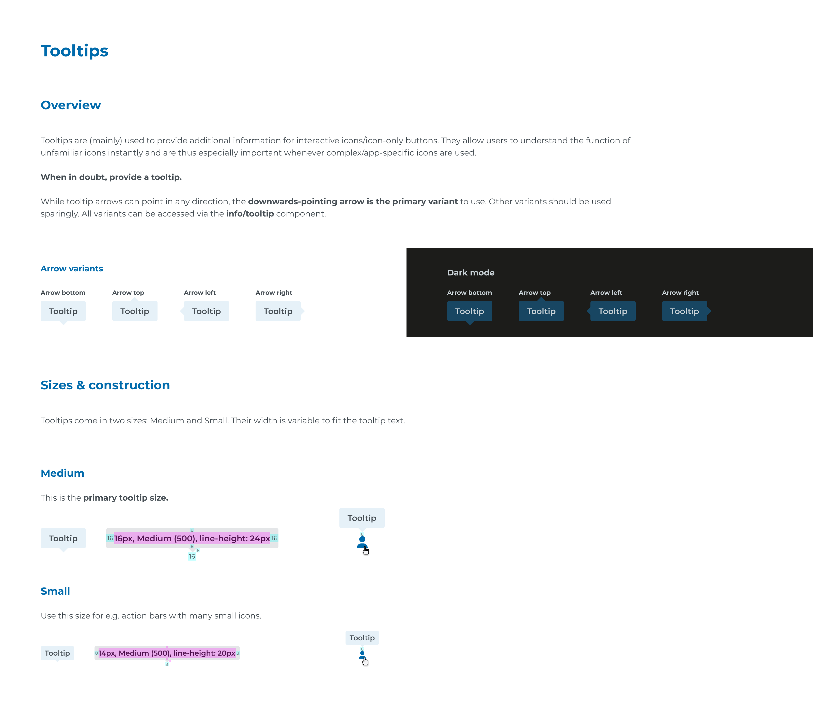

# Ecosystem Design Guidelines - Mandatory Layer-7

## Page 1

Tooltips
Overview
Sizes & construction
Medium
Small
Arrow variants
Tooltip
16px, Medium (500), line-height: 24px
Tooltip
14px, Medium (500), line-height: 20px
Arrow bottom
Arrow top
Arrow left
Arrow right
Tooltips are (mainly) used to provide additional information for interactive icons/icon-only buttons. They allow users to understand the function of 
unfamiliar icons instantly and are thus especially important whenever complex/app-specific icons are used. 

When in doubt, provide a tooltip.

While tooltip arrows can point in any direction, the downwards-pointing arrow is the primary variant to use. Other variants should be used 
sparingly. All variants can be accessed via the info/tooltip component.
Tooltips come in two sizes: Medium and Small. Their width is variable to fit the tooltip text.
This is the primary tooltip size.
Use this size for e.g. action bars with many small icons.
Tooltip
Tooltip
Tooltip
Tooltip
Tooltip
Tooltip
Dark mode
Arrow bottom
Arrow top
Arrow left
Arrow right
Tooltip
Tooltip
Tooltip
Tooltip
8
8
8
8
8
16
8
8
16
8
16

