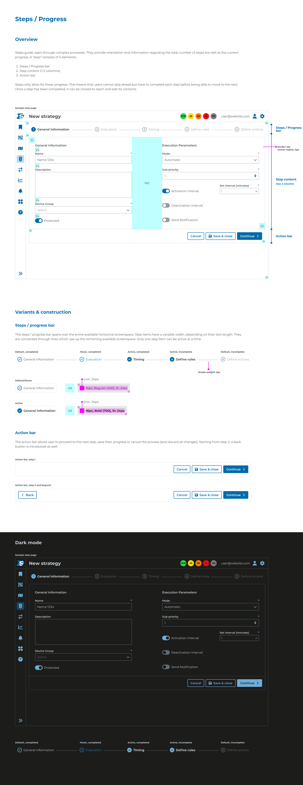

# Ecosystem Design Guidelines - Mandatory Layer-5

## Page 1

Steps / Progress
Overview
Variants & construction
Steps / progress bar
Action bar
Sample step page
Default, completed
Active, incomplete
Default, incomplete
Hover, completed
Active, completed
Steps guide users through complex processes. They provide orientation and information regarding the total number of steps are well as the current 
progress. A “step” consists of 3 elements: 

Steps / Progress bar
Step content (1-2 columns)
Action bar

Steps only allow for linear progress. This means that users cannot skip ahead but have to complete each step before being able to move to the next.  
Once a step has been completed, it can be clicked to reach and edit its contents. 
The steps / progress bar spans over the entire available horizontal screenspace. Step items have a variable width, depending on their text length. They 
are connected through lines which use up the remaining available screenspace. Only one step item can be active at a time. 
The action bar allows user to proceed to the next step, save their progress or cancel the process (and discard all changes). Starting from step 2, a back 
button is introduced as well. 
1
General information
2
Evaluation
3
Timing
4
Define rules
5
Define actions
General information
Name
*
Name 1234
Description
Device Group
*
Select
Protected
Execution Parameters
Mode
*
Automatic
Sub-priority
*
1
Activation Interval
Set interval (minutes)
*
1
Deactivation Interval
Send Notification
Cancel
Save & close
Continue
New strategy
1278
28
96
4
133
user@website.com
16
16
32
24
24
24
24
32
160
16
16
16
16
Cancel
Save & close
Continue
Back
Cancel
Save & close
Continue
Steps / Progress
bar
Step content
max 2 columns
Action bar
border: 1px
corner-radius: 4px
stroke-weight: 2px
General information
Evaluation
Timing
4
Define rules
5
Define actions
Default/Hover
Active
Action bar, step 1
Action bar, step 2 and beyond
General information
48
16px, Regular (400), lh: 24px
General information
48
16px, Bold (700), lh: 24px
8
8
12
12
12
12
Icon: 24px
Icon: 24px
Dark mode
Sample step page
1
General information
2
Evaluation
3
Timing
4
Define rules
5
Define actions
General information
Name
*
Name 1234
Description
Device Group
*
Select
Protected
Execution Parameters
Mode
*
Automatic
Sub-priority
*
1
Activation Interval
Set interval (minutes)
*
1
Deactivation Interval
Send Notification
Cancel
Save & close
Continue
New strategy
1278
28
96
4
133
user@website.com
Default, completed
Active, incomplete
Default, incomplete
Hover, completed
Active, completed
General information
Evaluation
Timing
4
Define rules
5
Define actions

