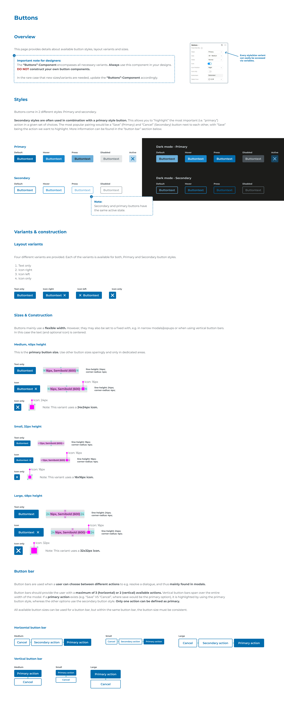

# buttons

## Page 1

Buttons
Styles
Overview
Variants & construction
Layout variants
Sizes & Construction
Button bar
Horizontal button bar
Vertical button bar
Primary
Medium, 40px height
Large, 48px height
Small, 32px height
Secondary
Buttons come in 2 different styles: Primary and secondary. 

Secondary styles are often used in combination with a primary style button. This allows you to “highlight” the most important (i.e. “primary”) 
action in a given set of choices. The most popular pairing would be a “Save” (Primary) and “Cancel” (Secondary) button next to each other, with “Save” 
being the action we want to highlight. More information can be found in the “button bar” section below. 
This page provides details about available button styles, layout variants and sizes.
Default
Every style/size variant 
can easily be accessed 
via variables. 
Default
Text only
Text only
Text only
Icon only
Icon only
Medium
Small
Large
Medium
Small
Large
Icon only
Icon
Icon
Icon
Text only
Hover
Hover
Icon right
Press
Press
Icon left
Disabled
Active
Disabled
Icon only
Four different variants are provided. Each of the variants is available for both, Primary and Secondary button styles. 

Text only
Icon right
Icon left
Icon only
This is the primary button size. Use other button sizes sparingly and only in dedicated areas.
Buttons mainly use a flexible width. However, they may also be set to a fixed with, e.g. in narrow modals/popups or when using vertical button bars. 
In this case the text (and optional icon) is centered.
Button bars are used when a user can choose between different actions to e.g. resolve a dialogue, and thus mainly found in modals. 

Button bars should provide the user with a maximum of 3 (horizontal) or 2 (vertical) available actions. Vertical button bars span over the entire 
width of the modal. If a primary action exists (e.g. “Save” VS “Cancel”, where save would be the primary option), it is highlighted by using the primary 
button style, whereas the other options use the secondary button style. Only one action can be defined as primary. 

All available button sizes can be used for a button bar, but within the same button bar, the button size must be consistent. 
Buttontext
Buttontext
Buttontext
Buttontext
Buttontext
16px, Semibold (600)
line-height: 24px;
corner-radius: 4px;
Buttontext
16px, Semibold (600)
line-height: 24px;
corner-radius: 4px;
Buttontext
12px, Semibold (600)
line-height: 16px;
corner-radius: 4px;
Note: This variant uses a 24x24px icon.
Note: This variant uses a 32x32px icon.
Note: This variant uses a 16x16px icon.
Buttontext
16px, Semibold (600)
line-height: 24px;
corner-radius: 4px;
Buttontext
16px, Semibold (600)
line-height: 24px;
corner-radius: 4px;
Buttontext
12px, Semibold (600)
line-height: 16px;
corner-radius: 4px;
Icon: 16px
Icon: 16px
Icon: 24px
Icon: 32px
Icon: 16px
Icon: 16px
Buttontext
Buttontext
Buttontext
Buttontext
Buttontext
Buttontext
Buttontext
Dark mode - Primary
Buttontext
Buttontext
Buttontext
Buttontext
Default
Hover
Press
Disabled
Active
Dark mode - Secondary
Buttontext
Buttontext
Buttontext
Buttontext
Default
Hover
Press
Disabled
8
8
8
8
8
8
8
8
8
8
8
8
8
16
8
12
12
12
12
12
8
8
8
12
12
12
12
16
8
16
24
24
24
24
16
8
8
8
8
Note: 
Secondary and primary buttons have 
the same active state.
Important note for designers: 
The “Buttons”-Component encompasses all necessary variants. Always use this component in your designs. 
 construct your own button components. 

In the rare case that new sizes/variants are needed, update the “Buttons”-Component accordingly. 
DO NOT
Cancel
Secondary action
Primary action
Cancel
Secondary action
Primary action
Cancel
Secondary action
Primary action
Primary action
Cancel
Primary action
Cancel
Primary action
Cancel

