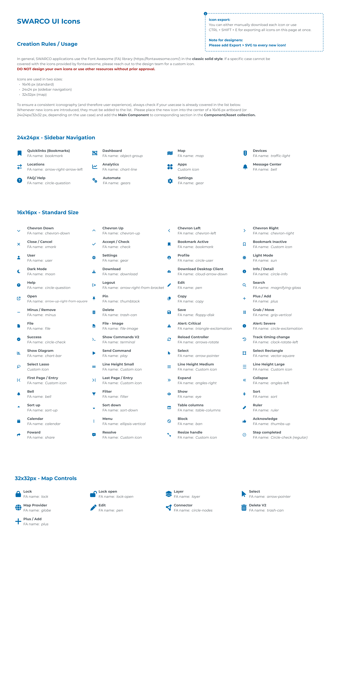
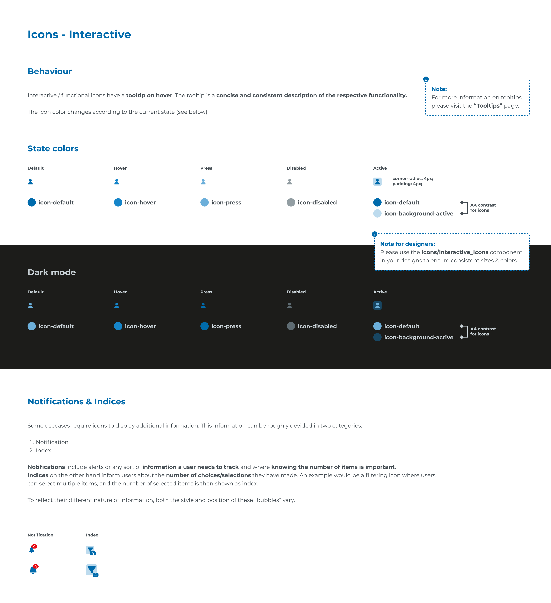

# swaroui icons

## Page 1

In general, SWARCO applications use the Font Awesome (FA) library (https://fontawesome.com/) in the classic solid style. If a specific case cannot be 
covered with the icons provided by fontawesome, please reach out to the design team for a custom icon. 
Icons are used in two sizes:  
16x16 px (standard)
24x24 px (sidebar navigation)
32x32px (map)

To ensure a consistent iconography (and therefore user experience), always check if your usecase is already covered in the list below. 
Whenever new icons are introduced, they must be added to the list.  Please place the new icon into the center of a 16x16 px artboard (or 
24x24px/32x32 px, depending on the use case) and add the Main Component to corresponding section in the Component/Asset collection.
DO NOT design your own icons or use other resources without prior approval.

SWARCO UI Icons
Creation Rules / Usage
24x24px - Sidebar Navigation
32x32px - Map Controls
16x16px - Standard Size
Quicklinks (Bookmarks)
FA name: bookmark
Dashboard
FA name: object-group
Map
FA name: map
Devices
FA name: traffic-light
Message Center
FA name: bell
Lock
FA name: lock
Lock open
FA name: lock-open
Layer
FA name: layer
Select
FA name: arrow-pointer
Map Provider
FA name: globe
Edit
FA name: pen
Connector
FA name: circle-nodes
Delete V2
FA name: trash-can
Plus / Add
FA name: plus
Locations
FA name: arrow-right-arrow-left
FAQ/ Help
FA name: circle-question
Analytics
FA name: chart-line
Automate
FA name: gears
Apps
Custom icon
Chevron Down
FA name: chevron-down
Chevron Up
FA name: chevron-up
Chevron Left
FA name: chevron-left
Chevron Right
FA name: chevron-right
Close / Cancel
FA name: xmark
Accept / Check
FA name: check
Bookmark Active
FA name: bookmark
Bookmark Inactive
FA name: Custom icon
User
FA name: user
Settings
FA name: gear
Profile
FA name: circle-user
Light Mode
FA name: sun
Settings
FA name: gear
Dark Mode
FA name: moon
Download
FA name: download
Download Desktop Client
FA name: cloud-arrow-down
Info / Detail
FA name: circle-info
Help
FA name: circle-question
Logout
FA name: arrow-right-from-bracket
Edit
FA name: pen
Search
FA name: magnifying-glass
Open
FA name: arrow-up-right-from-square
Pin
FA name: thumbtack
Copy
FA name: copy
Plus / Add
FA name: plus
Minus / Remove
FA name: minus
Delete
FA name: trash-can
Save
FA name: floppy-disk
Grab / Move
FA name: grip-vertical
File
FA name: file
File - Image
FA name: file-image
Alert: Critical
FA name: triangle-exclamation
Alert: Severe
FA name: circle-exclamation
Success
FA name: circle-check
Show Commands V2
FA name: terminal
Reload Controller
FA name: arrows-rotate
Track timing change
FA name: clock-rotate-left
Send Command
FA name: play
Select
FA name: arrow-pointer
Select Rectangle
FA name: vector-square
Show Diagram
FA name: chart-bar
Select Lasso
Custom Icon
Line Height Small
FA name: Custom icon
Line Height Medium
FA name: Custom icon
Line Height Large
FA name: Custom icon
First Page / Entry
FA name: Custom icon
Last Page / Entry
FA name: Custom icon
Expand
FA name: angles-right
Collapse
FA name: angles-left
Bell
FA name: bell
Filter
FA name: filter
Show
FA name: eye
Sort
FA name: sort
Sort up
FA name: sort-up
Calendar
FA name: calendar
Foward
FA name: share
Menu
FA name: ellipsis-vertical
Resolve
FA name: Custom icon
Resize handle
FA name: Custom icon
Step completed
FA name: Circle-check (regular)
Block
FA name: ban
Acknowledge
FA name: thumbs-up
Sort down
FA name: sort-down
Table columns
FA name: table-columns
Ruler
FA name: ruler
Icon export:
You can either manually download each icon or use 
CTRL + SHIFT + E for exporting all icons on this page at once.

Note for designers: 
Please add Export > SVG to every new icon!

## Page 2

Dark mode
icon-default
icon-hover
icon-press
icon-disabled
Default
Hover
Press
Disabled
icon-default
icon-background-active
Active
AA contrast
for icons
Icons - Interactive
State colors
Notifications & Indices
Behaviour
icon-default
icon-hover
icon-press
icon-disabled
icon-default
icon-background-active
Default
Notification
Hover
Index
Press
Disabled
Active
Interactive / functional icons have a tooltip on hover. The tooltip is a concise and consistent description of the respective functionality. 

The icon color changes according to the current state (see below).
Some usecases require icons to display additional information. This information can be roughly devided in two categories:

Notification
Index

Notifications include alerts or any sort of information a user needs to track and where knowing the number of items is important. 
Indices on the other hand inform users about the number of choices/selections they have made. An example would be a filtering icon where users 
can select multiple items, and the number of selected items is then shown as index.

To reflect their different nature of information, both the style and position of these “bubbles” vary.
AA contrast
for icons
corner-radius: 4px;
padding: 4px;
Note:
For more information on tooltips, 
please visit the “Tooltips” page.
Note for designers:
Please use the Icons/Interactive_Icons component 
in your designs to ensure consistent sizes & colors.
4
4
4
4

