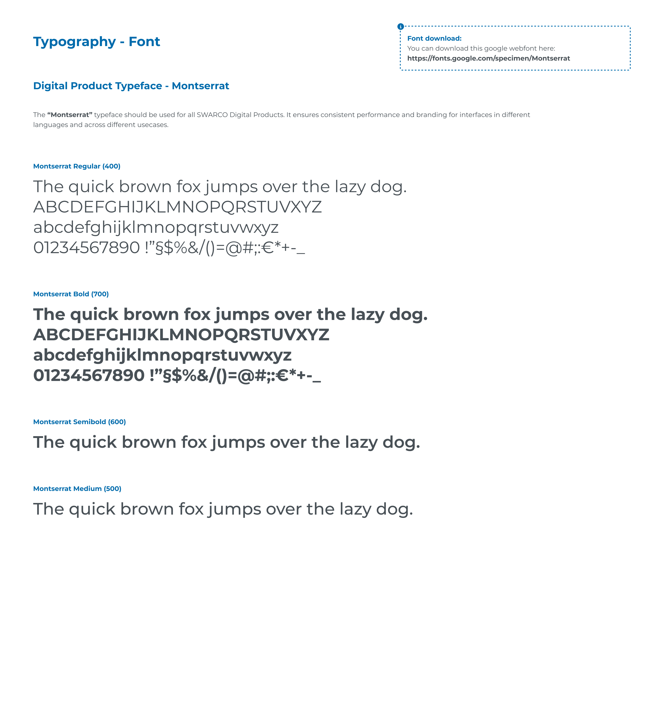
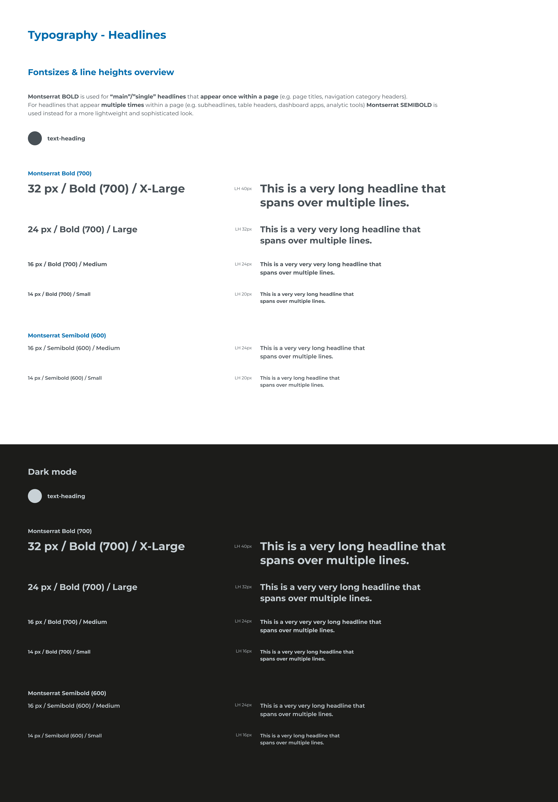
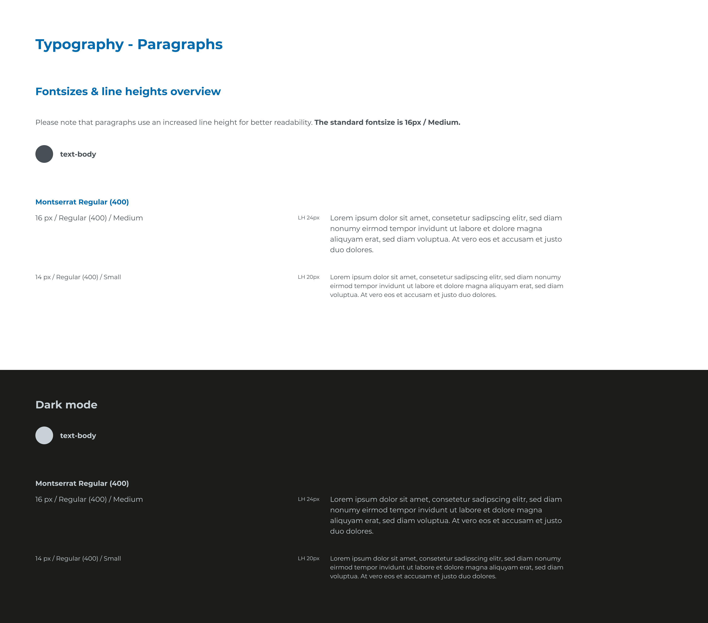
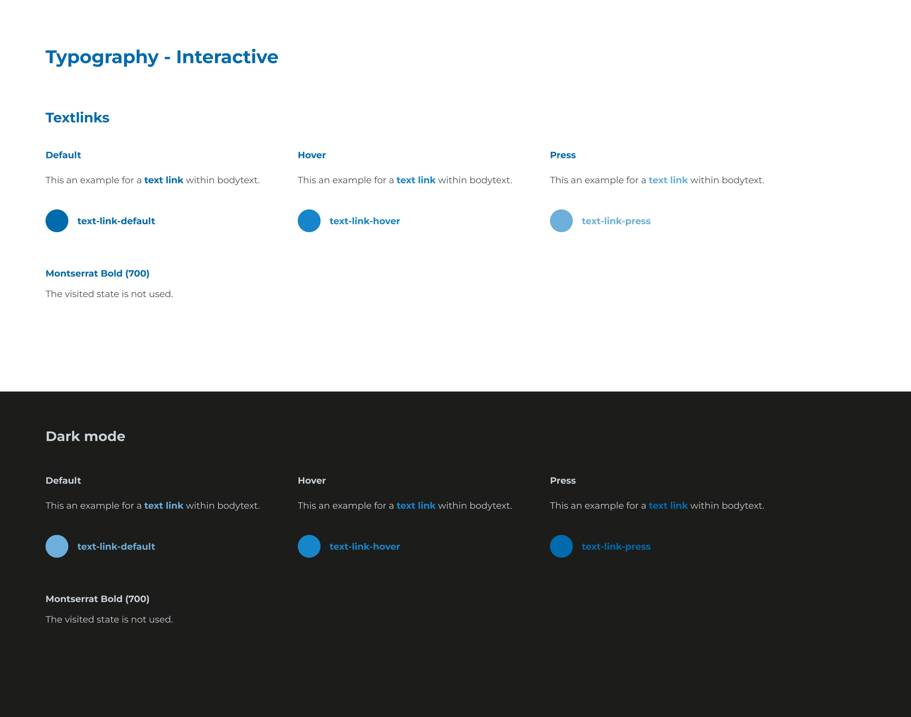

# typography

## Page 1

The “Montserrat” typeface should be used for all SWARCO Digital Products. It ensures consistent performance and branding for interfaces in different 
languages and across different usecases.
The quick brown fox jumps over the lazy dog. 
ABCDEFGHIJKLMNOPQRSTUVXYZ
abcdefghijklmnopqrstuvwxyz
01234567890 !”§$%&/()=@#;:€*+-_
The quick brown fox jumps over the lazy dog. 
ABCDEFGHIJKLMNOPQRSTUVXYZ
abcdefghijklmnopqrstuvwxyz
01234567890 !”§$%&/()=@#;:€*+-_
The quick brown fox jumps over the lazy dog.
The quick brown fox jumps over the lazy dog.
Typography - Font
Digital Product Typeface - Montserrat
Montserrat Regular (400)
Montserrat Bold (700)
Montserrat Semibold (600)
Montserrat Medium (500)
Font download:
You can download this google webfont here: 

https://fonts.google.com/specimen/Montserrat

## Page 2

32 px / Bold (700) / X-Large
LH 40px This is a very long headline that 
spans over multiple lines.
24 px / Bold (700) / Large
LH 32px
This is a very very long headline that
spans over multiple lines.
16 px / Bold (700) / Medium
LH 24px
This is a very very very long headline that
spans over multiple lines.
14 px / Bold (700) / Small
LH 20px
This is a very very long headline that
spans over multiple lines.
16 px / Semibold (600) / Medium
LH 24px
This is a very very long headline that
spans over multiple lines.
14 px / Semibold (600) / Small
LH 20px
This is a very long headline that
spans over multiple lines.
Typography - Headlines
Fontsizes & line heights overview
Montserrat BOLD is used for “main”/”single” headlines that appear once within a page (e.g. page titles, navigation category headers). 
For headlines that appear multiple times within a page (e.g. subheadlines, table headers, dashboard apps, analytic tools) Montserrat SEMIBOLD is 
used instead for a more lightweight and sophisticated look.
Montserrat Bold (700)
Montserrat Semibold (600)
text-heading
Dark mode
32 px / Bold (700) / X-Large
LH 40px This is a very long headline that 
spans over multiple lines.
24 px / Bold (700) / Large
LH 32px
This is a very very long headline that
spans over multiple lines.
16 px / Bold (700) / Medium
LH 24px
This is a very very very long headline that
spans over multiple lines.
14 px / Bold (700) / Small
LH 16px
This is a very very long headline that
spans over multiple lines.
16 px / Semibold (600) / Medium
LH 24px
This is a very very long headline that
spans over multiple lines.
14 px / Semibold (600) / Small
LH 16px
This is a very long headline that
spans over multiple lines.
Montserrat Bold (700)
Montserrat Semibold (600)
text-heading

## Page 3

16 px / Regular (400) / Medium
LH 24px
Lorem ipsum dolor sit amet, consetetur sadipscing elitr, sed diam 
nonumy eirmod tempor invidunt ut labore et dolore magna 
aliquyam erat, sed diam voluptua. At vero eos et accusam et justo 
duo dolores.
14 px / Regular (400) / Small
LH 20px
Lorem ipsum dolor sit amet, consetetur sadipscing elitr, sed diam nonumy 
eirmod tempor invidunt ut labore et dolore magna aliquyam erat, sed diam 
voluptua. At vero eos et accusam et justo duo dolores. 
Typography - Paragraphs
Fontsizes & line heights overview
Please note that paragraphs use an increased line height for better readability. The standard fontsize is 16px / Medium.
text-body
Montserrat Regular (400)
Montserrat Regular (400)
Dark mode
16 px / Regular (400) / Medium
LH 24px
Lorem ipsum dolor sit amet, consetetur sadipscing elitr, sed diam 
nonumy eirmod tempor invidunt ut labore et dolore magna 
aliquyam erat, sed diam voluptua. At vero eos et accusam et justo 
duo dolores.
14 px / Regular (400) / Small
LH 20px
Lorem ipsum dolor sit amet, consetetur sadipscing elitr, sed diam nonumy 
eirmod tempor invidunt ut labore et dolore magna aliquyam erat, sed diam 
voluptua. At vero eos et accusam et justo duo dolores. 
text-body

## Page 4

This an example for a 
 within bodytext.
text link
This an example for a 
 within bodytext.
text link
This an example for a 
 within bodytext.
text link
Default
Hover
Press
text-link-default
text-link-hover
text-link-press
Dark mode
The visited state is not used.
Montserrat Bold (700)
Typography - Interactive
Textlinks
This an example for a 
 within bodytext.
text link
The visited state is not used.
This an example for a 
 within bodytext.
text link
This an example for a 
 within bodytext.
text link
Default
Hover
Press
text-link-default
text-link-hover
text-link-press
Montserrat Bold (700)

