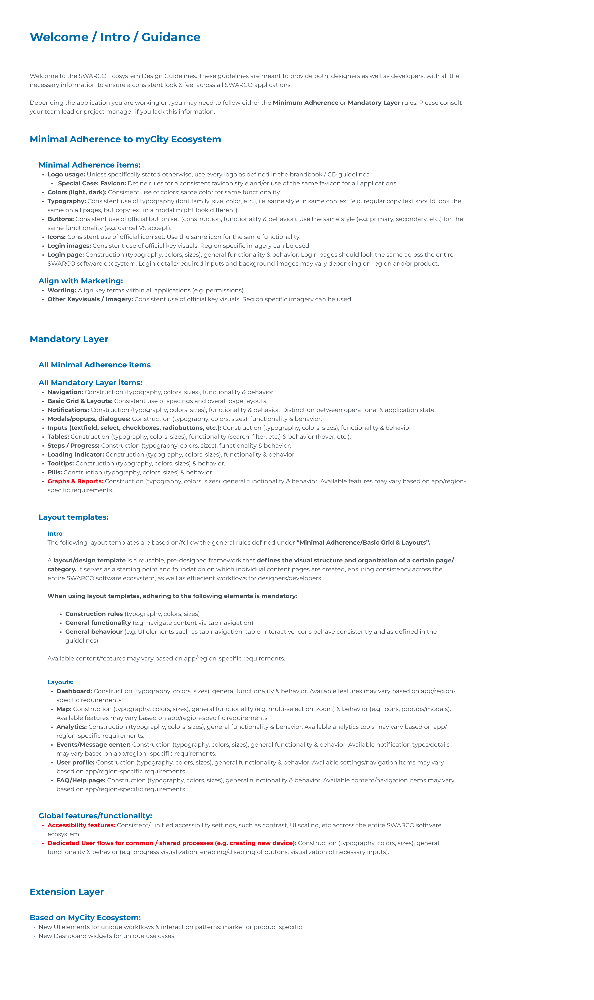

# welcome

## Page 1

Welcome / Intro / Guidance
Welcome to the SWARCO Ecosystem Design Guidelines. These guidelines are meant to provide both, designers as well as developers, with all the 
necessary information to ensure a consistent look & feel across all SWARCO applications. 

Depending the application you are working on, you may need to follow either the Minimum Adherence or Mandatory Layer rules. Please consult 
your team lead or project manager if you lack this information.  
Minimal Adherence to myCity Ecosystem 
Minimal Adherence items: ​ 
Align with Marketing: ​ 
Logo usage: Unless specifically stated otherwise, use every logo as defined in the brandbook / CD guidelines. 
 Special Case: Favicon: Define rules for a consistent favicon style and/or use of the same favicon for all applications. 
Colors (light, dark)​: Consistent use of colors; same color for same functionality.  
Typography: Consistent use of typography (font family, size, color, etc.), i.e. same style in same context (e.g. regular copy text should look the 
same on all pages, but copytext in a modal might look different). 
Buttons: Consistent use of official button set (construction, functionality & behavior). Use the same style (e.g. primary, secondary, etc.) for the 
same functionality (e.g. cancel VS accept).  
Icons: Consistent use of official icon set. Use the same icon for the same functionality.   
Login images​: Consistent use of official key visuals. Region specific imagery can be used. 
Login page: Construction (typography, colors, sizes), general functionality & behavior. Login pages should look the same across the entire 
SWARCO software ecosystem. Login details/required inputs and background images may vary depending on region and/or product. 

Wording: Align key terms within all applications (e.g. permissions). 
Other Keyvisuals / imagery​: Consistent use of official key visuals. Region specific imagery can be used.
Mandatory Layer 
All Minimal Adherence items 

All Mandatory Layer items: ​ 
N avigation: Construction (typography, colors, sizes), functionality & behavior.
Basic Grid & Layouts: Consistent use of spacings and overall page layouts. 
Notifications: Construction (typography, colors, sizes), functionality & behavior. Distinction between operational & application state. 
Modals/popups, dialogues: Construction (typography, colors, sizes), functionality & behavior. 
Inputs (textfield, select, checkboxes, radiobuttons, etc.): Construction (typography, colors, sizes), functionality & behavior.
Tables​: Construction (typography, colors, sizes), functionality (search, filter, etc.) & behavior (hover, etc.). 
Steps / Progress​: Construction (typography, colors, sizes), functionality & behavior.
Loading indicator: Construction (typography, colors, sizes), functionality & behavior. 
Tooltips: Construction (typography, colors, sizes) & behavior.
Pills: Construction (typography, colors, sizes) & behavior.
Construction (typography, colors, sizes), general functionality & behavior. Available features may vary based on app/region-
specific requirements.
Graphs & Reports:​ 
Layout templates:
Intro
Layouts:
The following layout templates are based on/follow the general rules defined under “Minimal Adherence/Basic Grid & Layouts”. 

A layout/design template is a reusable, pre-designed framework that defines the visual structure and organization of a certain page/
category. It serves as a starting point and foundation on which individual content pages are created, ensuring consistency across the 
entire SWARCO software ecosystem, as well as effiecient workflows for designers/developers. 


When using layout templates, adhering to the following elements is mandatory:

Construction rules (typography, colors, sizes)
General functionality (e.g. navigate content via tab navigation)
General behaviour (e.g. UI elements such as tab navigation, table, interactive icons behave consistently and as defined in the 
guidelines) 

Available content/features may vary based on app/region-specific requirements. 

Dashboard: Construction (typography, colors, sizes), general functionality & behavior. Available features may vary based on app/region-
specific requirements.
Map: Construction (typography, colors, sizes), general functionality (e.g. multi-selection, zoom) & behavior (e.g. icons, popups/modals). 
Available features may vary based on app/region-specific requirements.
Analytics: Construction (typography, colors, sizes), general functionality & behavior. Available analytics tools may vary based on app/
region-specific requirements.  
Events/Message center: Construction (typography, colors, sizes), general functionality & behavior. Available notification types/details 
may vary based on app/region -specific requirements.
User profile: Construction (typography, colors, sizes), general functionality & behavior. Available settings/navigation items may vary 
based on app/region-specific requirements. 
FAQ/Help page: Construction (typography, colors, sizes), general functionality & behavior. Available content/navigation items may vary 
based on app/region-specific requirements. 
Global features/functionality: ​
Accessibility  features:
Dedicated User flows for common / shared processes (e.g. creating new device):
 Consistent/ unified accessibility settings, such as contrast, UI scaling, etc accross the entire SWARCO software 
ecosystem. 
 Construction (typography, colors, sizes), general 
functionality & behavior (e.g. progress visualization; enabling/disabling of buttons; visualization of necessary inputs). 
Extension Layer 
Based on MyCity Ecosystem:​ 
N ew UI elements for unique workflows & interaction patterns: market or product specific​ 
New Dashboard widgets for unique use cases.  

